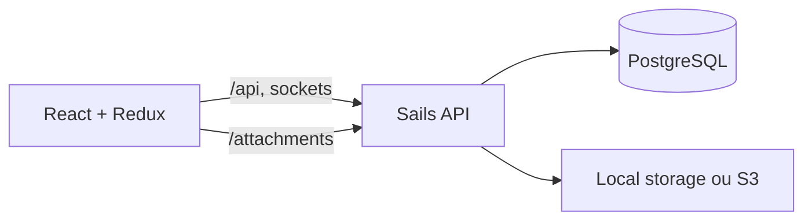

# Arquitetura

Taskbolt é um monólito web dividido entre cliente React e API Sails. O navegador recebe o bundle Vite e conversa com a API HTTP e com o canal Socket.IO; o servidor concentra autorização, regras de negócio, persistência e gestão de arquivos.

## Visão do sistema

## Camadas

- **Apresentação:** `client/src/components/` organiza as telas por domínio; `client/src/actions/`, `selectors/`, `sagas/` e `models/` controlam estado e efeitos.
- **Transporte:** `server/config/routes.js` expõe rotas e `server/api/controllers/` trata a entrada HTTP.
- **Autorização e domínio:** `server/api/policies/`, `server/api/helpers/` e hooks aplicam escopo de usuário, validação e operações de domínio.
- **Persistência:** `server/api/models/` define entidades e associações; `server/db/migrations/` evolui o PostgreSQL.
- **Infraestrutura:** `server/api/hooks/file-manager/` abstrai armazenamento local/S3, e `server/config/` concentra configuração do Sails.

## Padrões relevantes

| Padrão | Local | Uso |
| --- | --- | --- |
| Controller + helper | `server/api/controllers/`, `server/api/helpers/` | Mantém transporte separado da regra de negócio. |
| Redux-Saga | `client/src/sagas/` | Coordena chamadas de API, sockets e efeitos assíncronos. |
| Redux-ORM | `client/src/models/` | Normaliza entidades do domínio no estado do cliente. |
| Feature folders | `client/src/components/` | Agrupa a interface por domínio, como cards, boards e forms. |
| Adaptador de storage | `server/api/hooks/file-manager/` | Alterna arquivos locais e S3 sem vazar detalhes ao domínio. |

## Pontos de entrada

- `server/app.js`: processo Sails.
- `client/src/index.jsx`: bootstrap do React.
- `client/vite.config.js`: servidor Vite e proxy de desenvolvimento.
- `docker-compose.yml` e `docker-compose-dev.yml`: execução em contêiner.

## Limites e decisões

O cliente não acessa o banco diretamente; toda autorização fica no servidor. Anexos entram pelo servidor para que tamanho, tipo de arquivo e permissões sejam aplicados antes da persistência. O fork mantém o código próximo ao Planka, portanto atualizações do upstream devem ser avaliadas contra as mudanças em `origin/bolt/main`.
